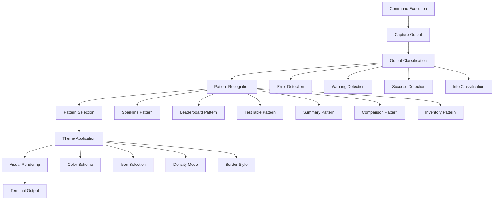
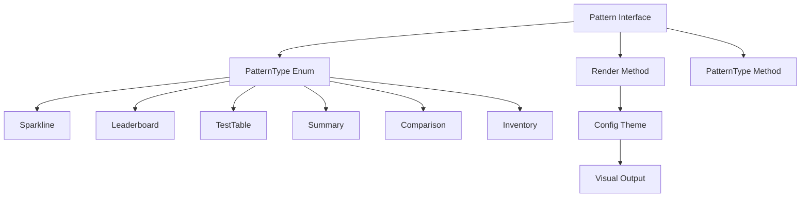
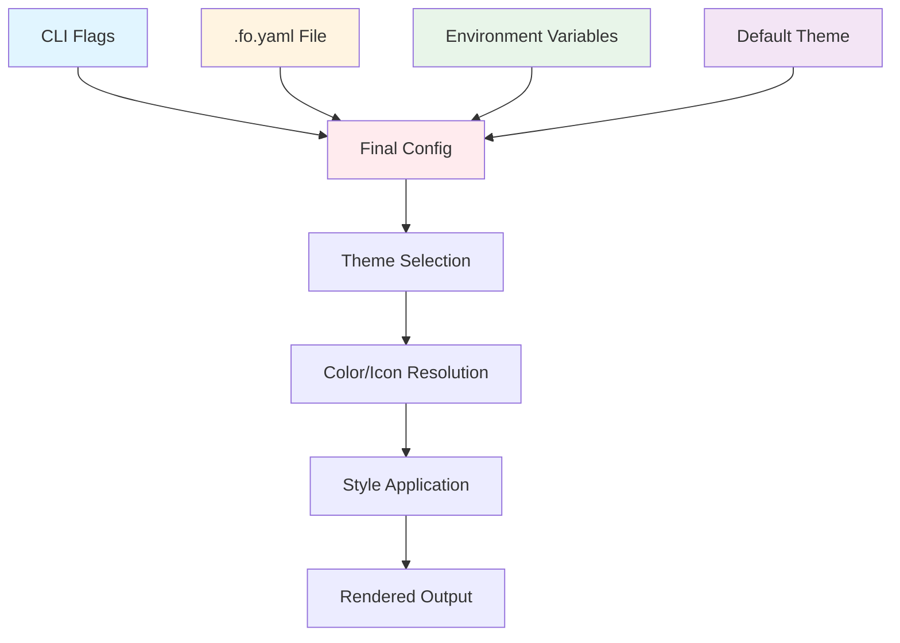
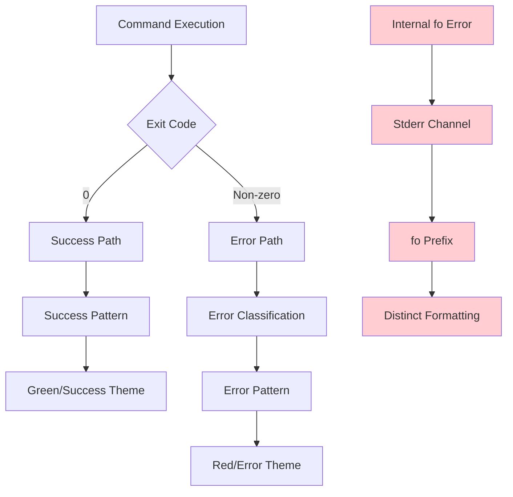
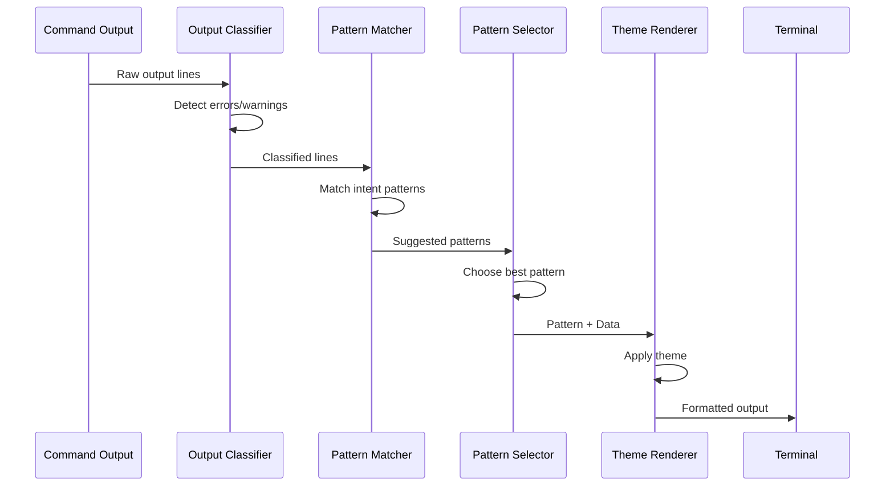
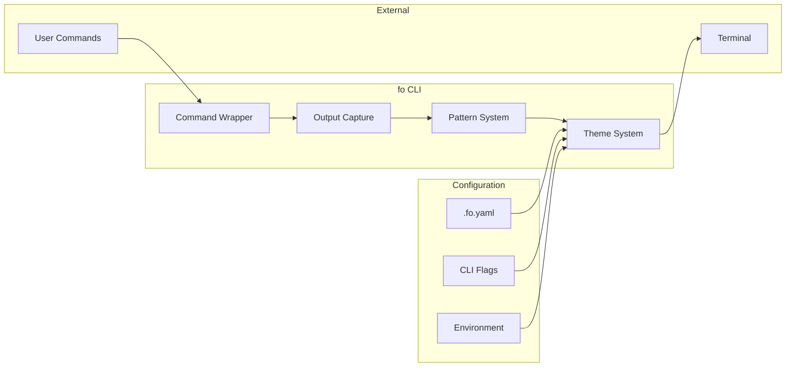

# fo Architecture: Conceptual Model

This document provides conceptual diagrams showing how fo processes command output and transforms it into structured visual patterns.

## Information Flow

## Pattern Type Hierarchy

## Config Resolution Flow

## Error Propagation Paths

## Pattern Recognition Process

## System Boundaries

## Key Concepts

### 1. Separation of Concerns

- **Semantic Layer (Patterns)**: What to show (data, structure, meaning)
- **Visual Layer (Theme)**: How to show it (colors, icons, density, borders)
- **Execution Layer (CLI)**: Command wrapping and output capture

### 2. Pattern-Based Architecture

Patterns are composable units that can be combined to create dashboards. Each pattern has:
- A semantic contract (data structure)
- A visual contract (rendering behavior)
- A type identifier (PatternType enum)

### 3. Theme Independence

The same pattern can be rendered with different themes:
- `unicode_vibrant`: Rich icons, colors, sparklines
- `ascii_minimal`: Plain ASCII for compatibility
- Custom themes: User-defined via `.fo.yaml`

### 4. Cognitive Load Awareness

The system adapts rendering complexity based on:
- Output size (line count)
- Error/warning density
- Pattern complexity
- User preferences

## Related Documentation

- [Pattern Types Specification](pattern-types.md)
- [ADR-001: Pattern-Based Architecture](../adr/ADR-001-pattern-based-architecture.md)
- [Product Vision](../VISION_REVIEW.md)

